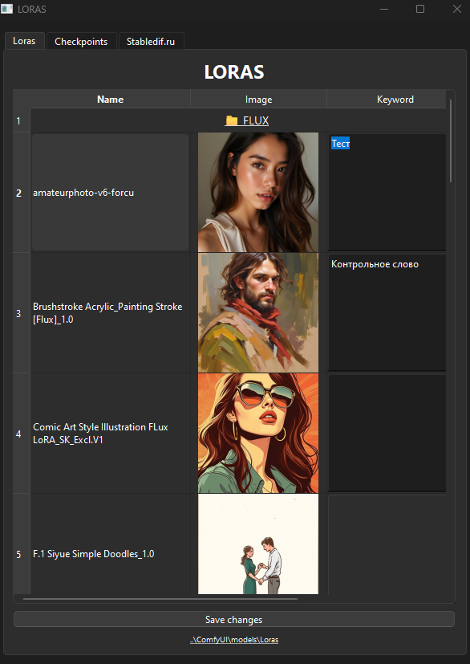

# 🤫 CatalogLoras

Это небольшое Desktop приложение (exe), которое сканирует ваш каталог Loras и checkpoints в ComfyUI Portable на наличие изображений в формате png. Приложение отображает таблицу с названием lora и checkpoints, изображения к этим моделям и редактируемое поле с примечанием.

📌Зачем это приложение нужно?
Это приложение поможет вам сориентироваться в ваших Lora и Checkpoint моделях, вспомнить стиль и вспомнить контрольное слово и другие заметки, которые вы напротив напишите.

📌Как пользоваться этим приложением?
- Скачайте архив с приложением и распакуйте его в корнеde. папку ComfyUI Portable.
- Внутри корневой папки ComfyUI Portable должна получится папка CatalogLoras и в ней должен быть файл CatalogLoras.exe и иконка приложения logo_loras.ico.
- Если вы добавите заметки в приложении то в этом же каталоге будет создан файл loras-config.json и checkpoints-config.json содержащие ваши саметки.
- Сохраните рядом с моделями Lora и Checkpoints одноименные изображения в формате png, которые помогут вспомнить, что это за модели.

#### 🔗 [СКАЧАТЬ ПРИЛОЖЕНИЕ](https://github.com/orex2121/CatalogLoras/releases/tag/CatalogLorasComfyUI)

💡 Надеюсь это приложение поможет вам не запутаться в многообразии Lora и Checkpoints 💡
## Купить кофе разработчикам: ☕  ☕  ☕
Дайте мне знать, если у вас возникнут какие-либо проблемы и мы постараемся их исправить!
Поддержать этот проект можно по ссылке: ❤️❤️❤️ **[D O N A T](https://www.donationalerts.com/r/orex21)** ❤️❤️❤️

## ⚒️ Ведущие проекта ⚒️
- OreX (Олег К.)
